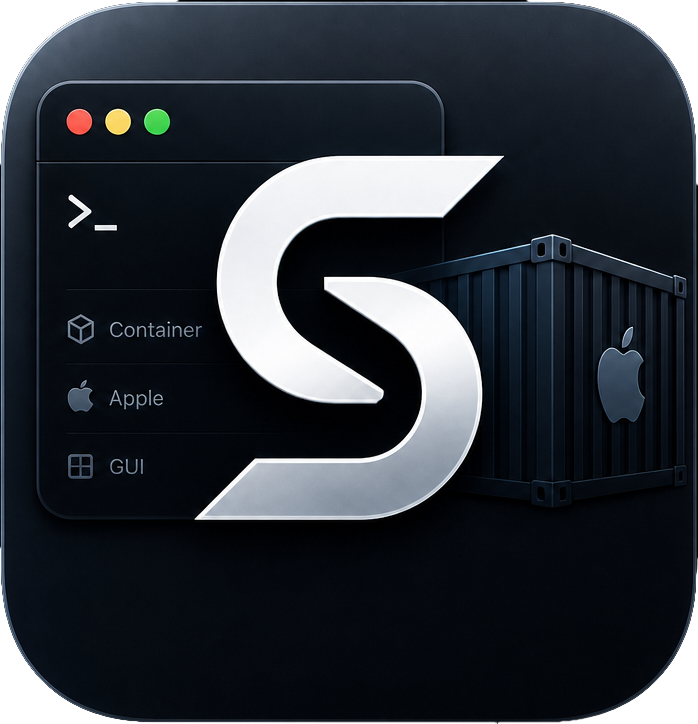

# ContainerUI

ContainerUI 是一款原生 macOS 桌面应用，为 **`container`** CLI 运行时提供图形化管理界面。你可以把它理解为 Apple 容器生态的 "Docker Desktop"——通过简洁的 SwiftUI 界面管理容器、镜像和系统资源。

[English Documentation](README.md)

<p align="center">
  
</p>

## 功能特性

### 仪表盘
- 系统健康概览，支持容器守护进程的启动/停止
- 磁盘使用详情（镜像、容器、数据卷、可回收空间）
- 容器和镜像数量一览
- API 服务器版本信息

### 容器管理
- **列表与搜索** — 浏览所有容器，实时状态指示，支持按运行状态过滤、按名称或镜像搜索
- **生命周期控制** — 通过滑动操作或右键菜单执行启动、停止、强制终止、删除
- **详细信息** — 查看完整容器配置，包括端口映射、挂载点、环境变量、标签及网络设置
- **实时监控** — CPU、内存、I/O 和网络使用情况，每 2 秒自动刷新
- **日志查看** — 等宽字体可滚动日志查看器

### 创建容器
- 选择镜像并指定名称
- 配置 CPU 核心数（步进调节）和内存限制
- 动态端口映射（主机 ↔ 容器）
- 数据卷挂载
- 环境变量配置
- 网络选择
- 开关选项：Rosetta 模拟、SSH 访问、只读根文件系统

### 镜像管理
- **列表与搜索** — 浏览本地镜像，显示平台标签、大小和创建日期
- **拉取** — 从远程仓库按引用拉取镜像
- **删除** — 滑动即可删除未使用的镜像

### 镜像构建
- 通过原生文件选择器选择构建上下文目录
- 为构建结果设置标签
- 实时查看构建日志

### 双语界面
- 完整支持英文和简体中文（各 142 条翻译）
- 通过菜单栏（`⌘E` / `⌘C`）或工具栏即时切换语言
- 首次启动自动检测系统语言

## 运行要求

| 依赖 | 版本 |
|------|------|
| **macOS** | 15.0 (Sequoia) 或更高 |
| **Swift** | 6.0 |
| **Xcode** | 16.0+（推荐） |
| **Container CLI** | `/usr/local/bin/container` |

> **注意**：ContainerUI 依赖 `container` CLI 运行时已安装在 `/usr/local/bin/container`。若找不到该可执行文件，应用将显示错误提示。

## 安装

### 从源码构建

```bash
# 克隆仓库
git clone git@github.com:SterbenSQ/container-ui.git
cd container-ui

# Debug 模式构建
swift build

# Release 模式构建
swift build -c release

# 运行
swift run
```

### 生成 Xcode 项目（可选）

```bash
swift package generate-xcodeproj
open ContainerUI.xcodeproj
```

## 架构

ContainerUI 采用 **MVVM**（Model-View-ViewModel）模式，完全基于 SwiftUI 构建：

```
┌──────────────────────────────────────┐
│  /usr/local/bin/container (CLI)      │  ←  外部运行时
└──────────────┬───────────────────────┘
               │  Process (子进程)
┌──────────────▼───────────────────────┐
│  ContainerService (actor)            │  ←  服务层
│  - JSON / 纯文本命令执行              │
│  - 60 秒超时, 基于临时文件的 I/O      │
└──────────────┬───────────────────────┘
               │  async/await
┌──────────────▼───────────────────────┐
│  ViewModels (@MainActor Observable)  │  ←  业务逻辑
│  - 轮询、状态管理、错误处理            │
└──────────────┬───────────────────────┘
               │  @Published / @EnvironmentObject
┌──────────────▼───────────────────────┐
│  Views (SwiftUI)                     │  ←  界面层
│  - 4 个标签页的 TabView              │
│  - 响应式国际化                       │
└──────────────────────────────────────┘
```

### 关键设计决策

- **零外部依赖** — 纯 Swift + SPM，无第三方包
- **Actor 服务层** — `ContainerService` 作为 `actor` 保证子进程执行的线程安全
- **@MainActor ViewModels** — 所有 UI 状态变更均发生在主 actor
- **环境依赖注入** — `LocalizationManager` 和 `DashboardViewModel` 在根部注入，全局可用
- **结构化并发** — 自动刷新循环使用 `Task.sleep`，视图消失时自动取消
- **类型化错误处理** — `ContainerError` 枚举，每种错误附带本地化描述

## 项目结构

```
ContainerUI/
├── Package.swift                    # SPM 清单（macOS 15+, Swift 6.0）
├── Sources/
│   └── ContainerUI/
│       ├── App.swift                # @main 入口
│       ├── ContentView.swift        # 根标签布局
│       ├── Models/                  # Codable 数据模型
│       │   ├── ContainerModel.swift
│       │   ├── ImageModel.swift
│       │   └── SystemModel.swift
│       ├── Services/               # 业务逻辑层
│       │   ├── ContainerService.swift
│       │   └── LocalizationManager.swift
│       ├── ViewModels/             # Observable 状态对象
│       │   ├── DashboardViewModel.swift
│       │   ├── ContainerListViewModel.swift
│       │   ├── ContainerDetailViewModel.swift
│       │   ├── ContainerCreateViewModel.swift
│       │   ├── ImageListViewModel.swift
│       │   └── ImageBuildViewModel.swift
│       ├── Views/                  # SwiftUI 视图
│       │   ├── DashboardView.swift
│       │   ├── ContainerListView.swift
│       │   ├── ContainerRowView.swift
│       │   ├── ContainerDetailView.swift
│       │   ├── ContainerCreateView.swift
│       │   ├── ImageListView.swift
│       │   ├── ImageRowView.swift
│       │   └── ImageBuildView.swift
│       └── Resources/
│           └── localization/
│               ├── en.json         # 142 条英文字符串
│               └── zh.json         # 142 条中文字符串
```

## 使用说明

### 键盘快捷键

| 快捷键 | 功能 |
|--------|------|
| `⌘E` | 切换为英文 |
| `⌘C` | 切换为简体中文 |

### 标签页

| 标签 | 用途 |
|------|------|
| **仪表盘** | 系统状态、磁盘使用、版本信息 |
| **容器** | 列出、创建、管理容器 |
| **镜像** | 列出、拉取、删除镜像 |
| **构建** | 从目录构建镜像 |

## 许可证

[MIT](LICENSE) © 2026 [SterbenSQ](https://github.com/SterbenSQ)
